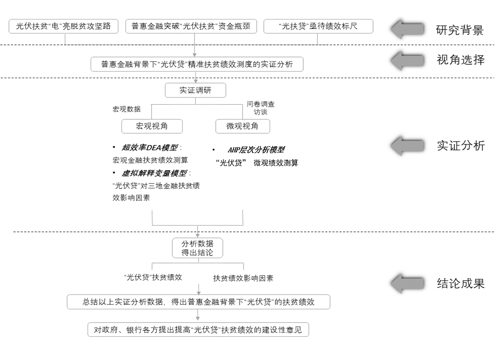
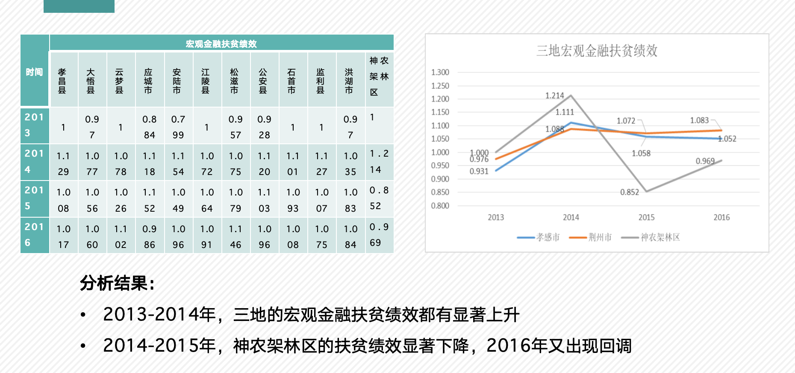

# Financial Loan Performance Evaluation  
### *(SolarLoan–PovertyAlleviation)*  

📌 **An empirical study on the impact of solar loans (光伏贷) in poverty alleviation under the framework of inclusive finance** — combining **DEA efficiency model, regression analysis, AHP weighting, surveys, and expert interviews**.  

---

## 📖 Project Overview
This project was conducted under the **National Undergraduate Innovation Training Program (大创项目)** at Zhongnan University of Economics and Law.  
It evaluates the **performance of solar loans (光伏贷)** as a financial instrument for poverty alleviation in Hubei Province (Jingzhou, Xiaogan, Shennongjia).  

The study combines **quantitative modeling** and **field research** to measure both macro-level and micro-level impacts:  
- **Macro perspective:** Does solar loan policy improve regional financial poverty alleviation efficiency?  
- **Micro perspective:** How do farmers perceive the benefits and risks of solar loans?  

---

## 🧩 Methodology
We used a **multi-layered evaluation approach** combining quantitative and qualitative methods:

### 1. Macro-Level Analysis
- **Super-Efficiency DEA Model** to measure regional financial poverty alleviation efficiency.  
- **Regression Models** (with virtual explanatory variables) to test the effect of solar loan introduction on regional development.  

### 2. Micro-Level Analysis
- **AHP (Analytic Hierarchy Process)** to construct a performance evaluation index system.  
- **Survey Data** (questionnaires distributed to farmers) with Likert scale ratings.  
- **Delphi Method** to weight expert opinions.  

### 3. Qualitative Insights
- **Field Interviews** with experts, local banks, and solar installation companies:contentReference[oaicite:5]{index=5}.  
- **Case studies** comparing different implementation models.  

---

## 📊 Key Findings
- **Macro Results:** The solar loan (光伏贷) policy significantly enhanced regional financial poverty alleviation efficiency. Regions implementing the policy showed measurable improvement in poverty reduction outcomes.  

- **Micro Results:** At the household level, farmers generally evaluated the policy as “Good (良)”. However, concerns remain about repayment risks, product quality, installation and maintenance, and insurance coverage.  
- **Policy Gaps:** Solar loans are an effective tool under inclusive finance for poverty alleviation, but their success depends heavily on improving loan processes, ensuring equipment reliability, strengthening after-sales services, and raising farmers’ financial literacy.  

---

## 🙋 Personal Contributions
Throughout this project, I was deeply involved in every stage of the research process, from conceptualization to the final defense. In the early phase, I took primary responsibility for drafting the **research methodology**, particularly the design and explanation of the DEA efficiency model and the AHP hierarchy model. This required translating complex financial and statistical theories into a structured framework that could be applied to real-world poverty alleviation policies.  

During the fieldwork stage, I participated in **expert interviews** with policymakers and local financial practitioners, as well as the **design and distribution of farmer surveys** across the three target regions. Collecting first-hand insights gave me the opportunity to bridge theoretical analysis with grassroots perspectives, and I later compiled and cleaned these responses to prepare them for quantitative analysis.  

On the analytical side, I conducted both **macro- and micro-level data analysis**, using DEA and regression modeling to evaluate financial efficiency at the regional level, and applying AHP weighting and Likert-scale survey data to assess household-level impacts. I worked closely with my teammates to validate results, troubleshoot data inconsistencies, and ensure robustness in our findings.  

Finally, I co-authored the **final project report** and contributed significantly to our **defense presentations**. In these sessions, I presented the technical framework and findings to faculty panels, highlighting both the academic rigor and the real-world policy relevance of our work. Through this project, I honed not only my technical skills in quantitative modeling and data-driven policy analysis, but also my ability to communicate complex findings clearly and persuasively.  
